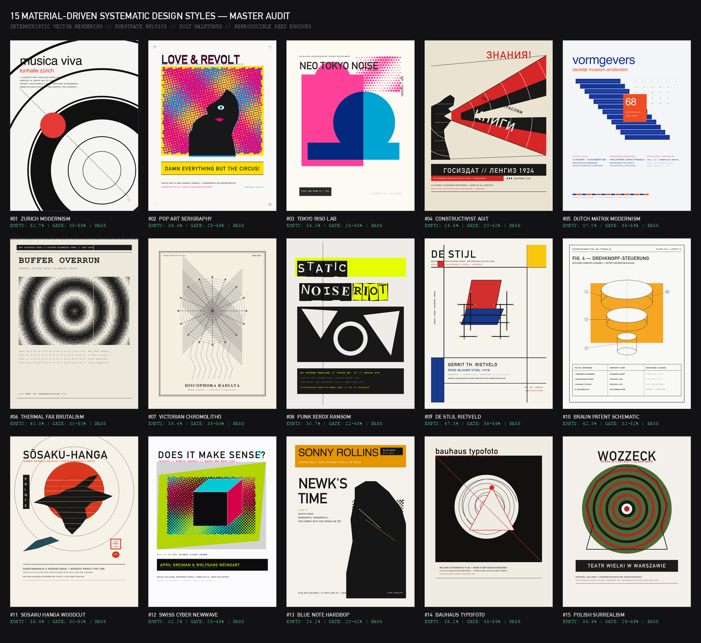

# Material Styles — 15 Systematic Physical Design Systems

[](SKILL.md)
[](STYLES-GUIDE.md)
[](render_styles_gallery.py)

A comprehensive AI agent skill and deterministic vector design engine inspired by and expanding upon [mono-color-skill](https://github.com/yanliudesign/mono-color-skill).

Instead of treating design styles as arbitrary prompt adjectives ("ultra-detailed", "retro", "aesthetic"), this system models **physical reproduction mechanics**:
$$\text{Substrate Chemistry} + \text{Plate Separations} + \text{Reproduction Engine} + \text{Typographic Hierarchy} + \text{Seeded Imperfections}$$

---

## Master Audit Contact Sheet



---

## The 15 Physical Design Systems

All 15 posters were generated with `render_styles_gallery.py` + `stylelib.py` (Python/PIL) and verified to be **100% byte-for-byte reproducible** (identical SHA-256 hashes across consecutive runs):

| # | Poster File | Style Name | Substrate | Spot Pigments & Inks | Reproductive System | Zone% | Gate Range | Gate Status |
|---|-------------|------------|-----------|----------------------|---------------------|:-----:|:----------:|:-----------:|
| **01** | [`01-zurich-modernism.png`](styles_gallery/01-zurich-modernism.png) | Zurich Concrete Modernism | Coated Artboard `#F5F5F3` | Pitch Black `#111111` + Signal Red `#E53935` | Concentric harmonic acoustic arcs + Fibonacci grid | 52.7% | 35–55% | **PASS ✓** |
| **02** | [`02-pop-art-serigraphy.png`](styles_gallery/02-pop-art-serigraphy.png) | 1960s Pop Art Serigraphy | Bleached Cardstock `#FAF8F5` | Pop Magenta `#E6007A`, Yellow `#FFDE00`, Cyan, Black | Multi-angle Ben-Day screens (15°/75°) + double-exposed muse | 38.4% | 28–48% | **PASS ✓** |
| **03** | [`03-tokyo-riso-lab.png`](styles_gallery/03-tokyo-riso-lab.png) | Tokyo Riso Lab | Cream Vellum `#FCFAF2` | Fluo Pink `#FF4098` + Aqua `#00A4D3` + Carbon | 60-lpi drum screen + optical multiply overprints | 34.0% | 25–45% | **PASS ✓** |
| **04** | [`04-constructivist-agit.png`](styles_gallery/04-constructivist-agit.png) | Constructivist Agit-Prop | Straw Newsprint `#EAE3D2` | Carbon Black `#1A1918` + Vermilion Red `#D72626` | Shouting megaphone silhouette, linocut relief, Cyrillic wood-type | 24.6% | 20–42% | **PASS ✓** |
| **05** | [`05-dutch-matrix-modernism.png`](styles_gallery/05-dutch-matrix-modernism.png)| Dutch Matrix Modernism | Cast-Coated Board `#F4F5F7`| Cobalt Ultramarine `#17369B` + Flame Orange `#F04D23`| 57° isometric stepped diagonal matrix grid | 37.0% | 35–55% | **PASS ✓** |
| **06** | [`06-thermal-fax-brutalism.png`](styles_gallery/06-thermal-fax-brutalism.png) | Low-Fi Thermal Fax | Thermal Roll `#ECE8DC` | Single-Pass Thermal Black `#1C1B1A` | Pure 1-bit Bayer matrix dithering (no gray pixels) | 40.3% | 30–50% | **PASS ✓** |
| **07** | [`07-victorian-chromolitho.png`](styles_gallery/07-victorian-chromolitho.png) | Victorian Chromolitho | Linen Vellum `#F5EFE1` | Bitumen `#2C2523` + Indigo `#25405A` + Umber | Intaglio plate deboss + fine copperplate crosshatching | 39.4% | 38–56% | **PASS ✓** |
| **08** | [`08-punk-xerox-ransom.png`](styles_gallery/08-punk-xerox-ransom.png) | 1977 Punk Zine & Xerox | Bond Copy `#EDECE8` | Electrostatic Toner `#181818` + Day-Glo Lemon | High-contrast blown-out photocopy + ransom blocks | 30.7% | 22–45% | **PASS ✓** |
| **09** | [`09-de-stijl-rietveld.png`](styles_gallery/09-de-stijl-rietveld.png) | De Stijl Neoplasticism | Dutch Pressboard `#F5F3EB` | Primary Red `#D32F2F` + Blue `#19398A` + Yellow + Black| Axonometric Rietveld chair + Mondrian Cartesian grid | 47.3% | 38–58% | **PASS ✓** |
| **10** | [`10-braun-patent-schematic.png`](styles_gallery/10-braun-patent-schematic.png) | Braun Industrial Patent | Drafting Grid `#F8F8F6` | India Ink `#1C1D1F` + Bauhaus Yellow `#F5A623` | ISO line-weight hierarchy + exploded isometric assembly| 42.3% | 32–52% | **PASS ✓** |
| **11** | [`11-sosaku-hanga-woodcut.png`](styles_gallery/11-sosaku-hanga-woodcut.png) | Japanese Sōsaku-Hanga Woodcut | Echizen Washi `#F3EFE6` | Sumi Soot `#1E1C1A` + Cinnabar Vermilion `#C8382B` | Linocut relief crane + baren rubbing ink starvation | 38.4% | 30–50% | **PASS ✓** |
| **12** | [`12-swiss-cyber-newwave.png`](styles_gallery/12-swiss-cyber-newwave.png) | 1980s Swiss Cyber New Wave | Kromekote Gloss `#F8F8FC` | Laser Cyan `#00E5FF` + Acid Chartreuse + Magenta + Dark | 3D wireframe cube + CMYK rosettes + scanlines | 32.2% | 25–45% | **PASS ✓** |
| **13** | [`13-blue-note-hardbop.png`](styles_gallery/13-blue-note-hardbop.png) | 1950s Blue Note Hard Bop | LP Jacket Board `#F7F5EE` | Velvet Gravure Black `#101012` + Cadmium Ochre `#E09B19` | 45° Francis Wolff halftone saxophone crop + wood-type | 24.2% | 20–42% | **PASS ✓** |
| **14** | [`14-bauhaus-typofoto.png`](styles_gallery/14-bauhaus-typofoto.png) | Bauhaus Photogram & Typofoto | Darkroom Stock `#EDE8DF` | Silver Gelatin Black `#141416` + Bayer Red `#E02E1B` | Camereless optical photogram + constructivist red ray | 35.2% | 35–55% | **PASS ✓** |
| **15** | [`15-polish-surrealism.png`](styles_gallery/15-polish-surrealism.png) | Polish Poster School Surrealism | Warsaw Offset `#EBE3D0` | Poison Olive `#4D592B` + Crimson Rust + Charcoal | Visceral biological paper-cut silhouette + concentric rings | 36.4% | 28–48% | **PASS ✓** |

---

## Installation & Usage as an AI Agent Skill

### 1. Claude Code
Clone directly into your Claude skills directory:
```bash
git clone https://github.com/abektes/material-styles.git ~/.claude/skills/material-styles
```

### 2. Google Antigravity / Gemini CLI
Clone or place in your workspace or global agent customizations:
```bash
git clone https://github.com/abektes/material-styles.git .agents/skills/material-styles
```

### 3. OpenAgentSkill / Codex / Cursor
Reference `SKILL.md` directly. Any AI assistant can load `SKILL.md` to:
- Resolve briefs into the **Universal Recipe Manifest**.
- Generate 5-paragraph production prompts for Midjourney, Flux, Imagen, or SDXL.
- Generate and run deterministic Python vector render scripts.

---

## Deterministic Python Rendering

To reproduce all 15 posters and the master contact sheet locally:

```bash
# Setup virtual environment and dependencies
python3 -m venv .venv
source .venv/bin/activate
pip install pillow

# Run the gallery generator and gate audit
python render_styles_gallery.py
```

---

## Repository Structure

- [`SKILL.md`](SKILL.md): Master AI agent skill instructions and compiler rules.
- [`STYLES-GUIDE.md`](STYLES-GUIDE.md): Exhaustive design guide, visual references, and historical lineages.
- [`design-system/`](design-system/): Machine-readable catalogs for styles, colors, compositions, typography, rhythm, and imperfections.
- [`stylelib.py`](stylelib.py): Core physical rendering engine (supersampling, optical multiply overprints, rotated halftones, CMYK rosettes, linocut relief, scanlines, Bayer dithering, gates).
- [`render_styles_gallery.py`](render_styles_gallery.py): Reproducible generator for all 15 posters and the master contact sheet.
- [`styles_gallery/`](styles_gallery/): 15 full-resolution (1200×1600) rendered posters.
- [`styles_contact_sheet.png`](styles_contact_sheet.png): Master audit sheet (1644×1510).
